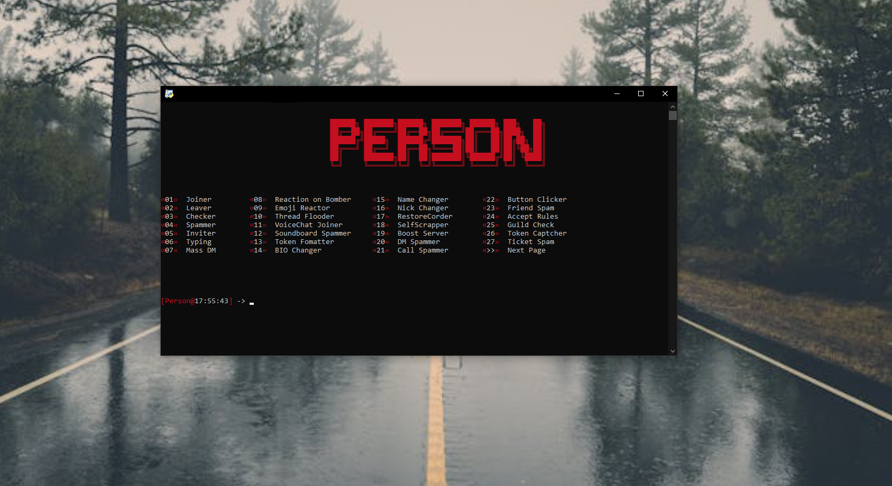

  

  <h3 align="center">[Person Multitool] - discord.gg/person</h3>

  

    Person-MultiTool is a Multitool Made to allow you to have more fun and freedom on discord
     
     
    <a href="https://discord.gg/person">Discord</a>
  

<h3 align="center">Feel free to star this project! ⭐</h3>
<h3 align="center">Only Windows supported! ✔</h3>
